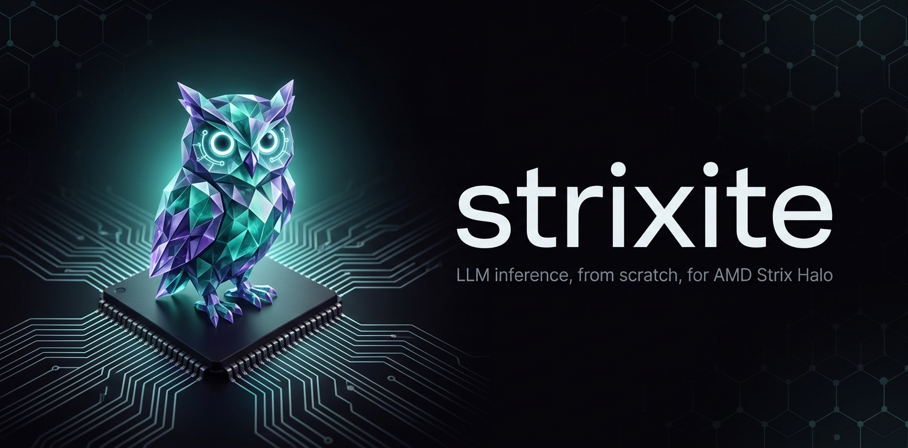

  
  
  
  

<h2 align="center">Nearly 50 tokens/s at half a million tokens of context. On one mini PC.</h2>

A ~180B-parameter model, a 512k context window, and decode speed that doesn't fall off as the conversation grows - 
measured in real agentic coding sessions, not a synthetic benchmark.

|  | on one AMD Strix Halo, 128 GB |
|---|---|
| **Decode, real agent use** | **~47-50 tokens/s, flat from 0 to 492k context** |
| **Context** | **512k tokens** |
| **Prefill** | **~1,370 tokens/s** over a real 490k-token conversation |
| **Agent tasks** | **19 / 19** on terminal-bench-mini's core suite |

## What it is

strixite is an LLM inference engine I wrote from scratch in HIP for exactly one chip and one model:

- **AMD Strix Halo** (Ryzen AI MAX+ 395 / Radeon 8060S, gfx1151) - the whole model on the iGPU, in unified memory
- **Qwen3.8-Flash-Next** - a 512-expert MoE with Gated DeltaNet linear attention, sparse attention and a
  51B-parameter n-gram table streamed from SSD, in ~66 GiB of 4/8-bit weights

No llama.cpp, no ggml, no vendor libraries underneath. Every kernel is hand-written and checked against a CPU
reference derived from the model's spec.

## Features

- **OpenAI-compatible server** - chat completions with streaming, tool calls and reasoning
- **Multi-token prediction** - the model's own draft head, up to 5 tokens checked per step
- **Prompt cache in RAM and on disk** - long agent conversations resume instead of being re-read every turn
- **512k context** with YaRN, and attention that stays fast at depth

## Get it

> [!NOTE]
> **Source code: coming soon™.** I'm getting it ready to share; until then this repository is a placeholder.

The weights are already up: **[wemoh/Qwen3.8-Flash-Next-strixw](https://huggingface.co/wemoh/Qwen3.8-Flash-Next-strixw)**
on Hugging Face (~115 GiB, no conversion step).

## Platform

strixite runs on **Linux with an AMD Strix Halo (gfx1151) and 128 GB of memory**, tested on Fedora 43. It's built
and tested by one person on one machine, so that's the only setup I can promise works; Windows and macOS aren't
supported, and I don't plan to add them. I can't take on ports to other platforms here, but forks are very welcome.

## License

[AGPL-3.0](LICENSE). The model weights are separate and under the Qwen Community License 1.0.
