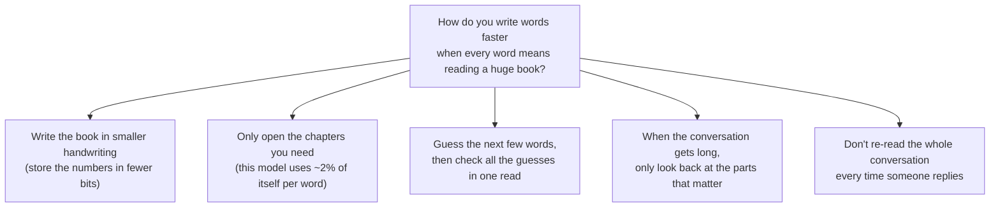
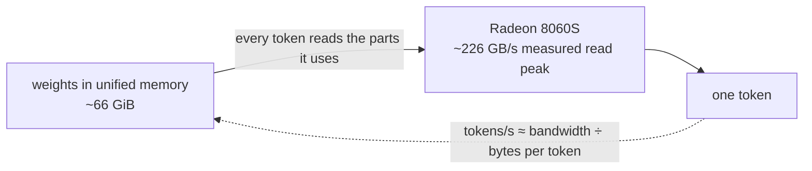
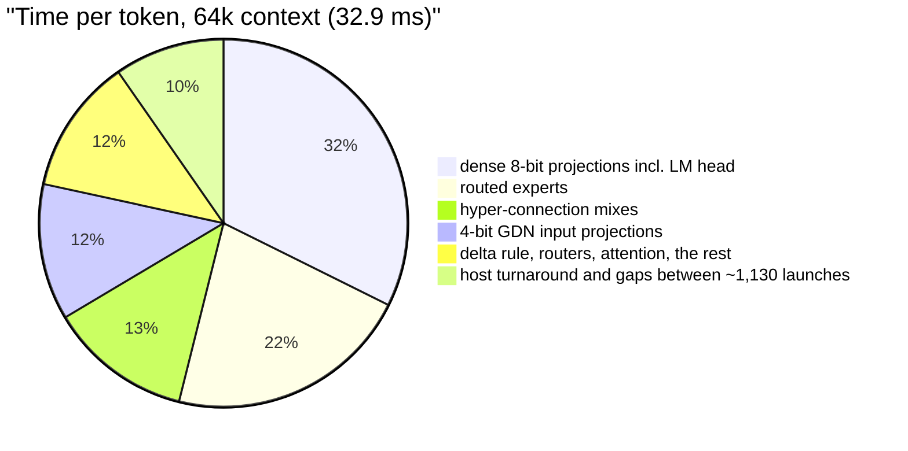
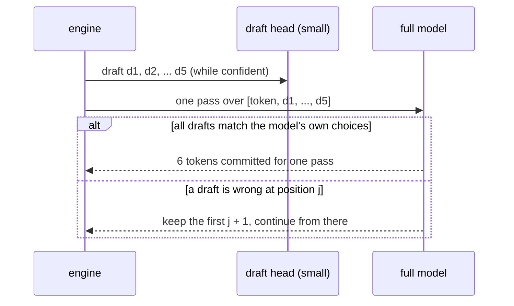
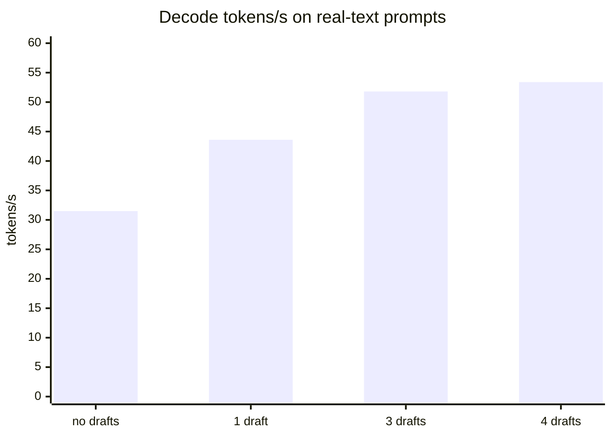
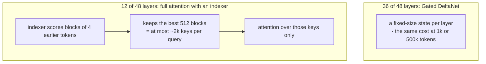
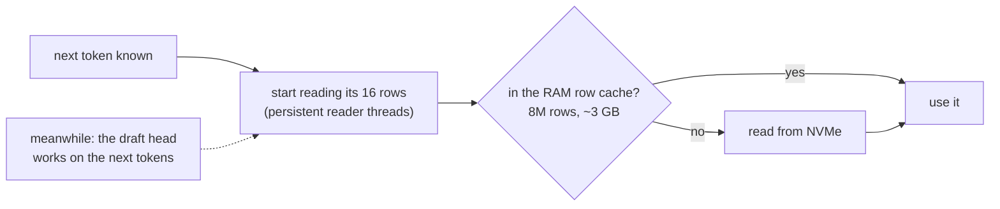
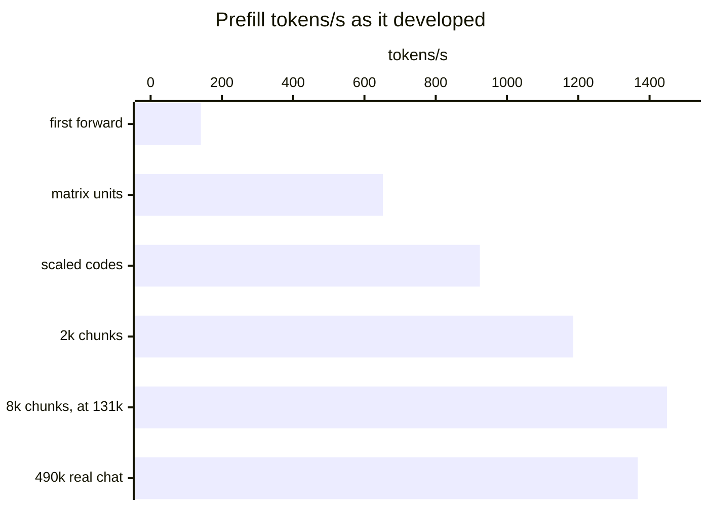
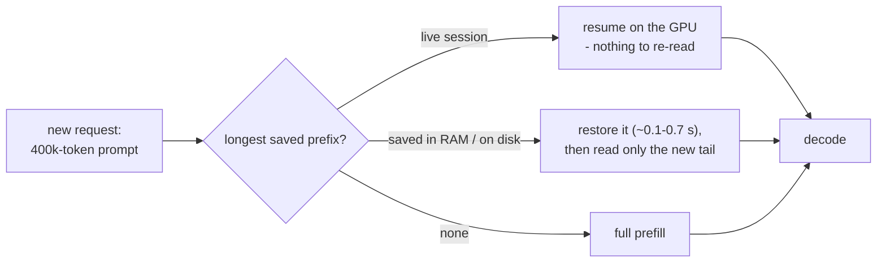
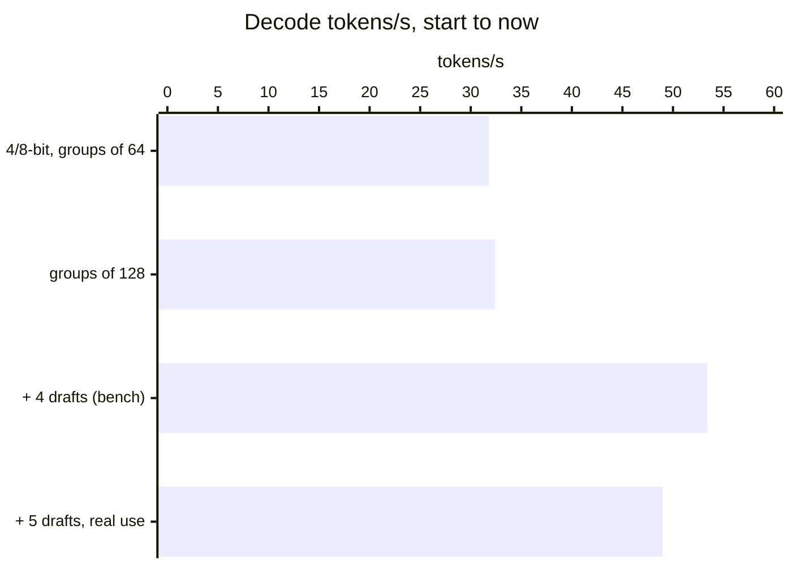

# How strixite got fast

strixite runs Qwen3.8-Flash-Next - a ~180B-parameter mixture-of-experts model - at ~47-50 tokens/s in real agentic
coding sessions, and that speed stays flat from an empty context out to 492k tokens. This is how it got there: the
handful of ideas that mattered, in the order they matter, with the numbers I measured along the way. It's the "why",
not the code - the code is in this repository.

All numbers are from one machine: an AMD Ryzen AI MAX+ 395 (Strix Halo, Radeon 8060S, gfx1151) with 128 GB of
unified memory, between late September and early October 2026.

The first section needs no background at all. The ones after it go deeper, one idea at a time.

## The short version

A language model is, at heart, an enormous pile of numbers - this one has about 180 billion of them. To write each
word of an answer, the computer has to read through the numbers that word needs. The thinking part is fast; the
**reading** is what takes the time. So making it fast comes down to five simple ideas:

1. **Smaller handwriting.** The numbers are stored in 4 or 8 bits instead of 16, so there's less to read. Done
   carefully, the answers barely change.
2. **Only the chapters you need.** This model is split into 512 specialists per layer, and each word consults only
   about 10 of them. The parts every word needs get more precision; the rarely used parts get less.
3. **Guess, then check.** A small helper guesses the next few words. The big model then checks all the guesses in a
   single read. When the guesses are right - and for code they usually are - you get several words for the price of
   one.
4. **Look back selectively.** In a long conversation, most of the model doesn't look back at all, and the rest only
   looks at the ~2,000 earlier words that matter most. That's why it's as fast at half a million words as at the
   start.
5. **Don't redo work.** An AI coding assistant sends the entire conversation again with every message. strixite
   remembers where it left off, so it only reads what's new.

That's it - the rest of this page is the same five ideas in detail, with the measurements, plus the things I tried
that didn't work.

## 1. The budget: decode is reading weights

Generating a token means running the whole model once, and for one token at a time that work is dominated by one
thing: **reading the weights from memory**. The arithmetic is cheap next to it. So the first question for any speed
idea is simply: *how many bytes does a token have to read?*

I measured the GPU's real read peak at ~226 GB/s (a long streaming read). Everything below is about reading fewer
bytes per token, reading them closer to that peak, or getting more tokens out of each read.

Where one plain decode step (no speculation) spent its time at 64k context, 32.9 ms in all:

The big kernels in that chart already run at 84-100% of the read peak. That's the lesson that shaped everything else:
once a kernel reads its bytes at the peak, the only ways to go faster are fewer bytes, or more tokens per read.

## 2. Fewer bytes: where the bits go

The model is a mixture of experts: 512 small expert networks per layer, of which each token uses about 10. The experts
are most of the file (~61 of 66 GiB), but a token reads only ~2% of them. The dense projections - attention, the
linear-attention layers, the shared expert, the LM head - are a few GiB, and **every token reads all of them**.

So bits are spent where they're cheap and saved where they're expensive:

| weights | format | why |
|---|---|---|
| routed experts | 4-bit, groups of 128 | most of the file, rarely read: 4 bits barely moves accuracy |
| dense projections, LM head | 8-bit | read every token, and where 4 bits hurt accuracy most |
| n-gram table (51B parameters) | int8 rows, on SSD | read a few rows per token - it never needs to be in memory at all (section 5) |

I chose these class by class from a quantization study against the full-precision model's outputs: mean KL
divergence 0.028, top-1 agreement at 226 of 242 positions. An all-4-bit layout took about a quarter less time per
token but agreed with the full model at only 194 of 242 positions; the 8-bit dense path is where accuracy lives. Going from groups of 64 to groups of 128 for the 4-bit classes kept the same
accuracy for 5.6% fewer bytes: 1.9% less time per token.

## 3. More tokens per read: multi-token prediction

The checkpoint ships a small extra layer trained to guess the token *after* the next one. strixite uses it to draft up
to 5 tokens ahead, then checks them all with **one** pass of the full model. That pass reads the weights once for
all the rows - and since decode is about reading weights, checking 5 tokens costs far less than generating 5.

Every committed token is still the full model's own choice - a draft only saves time when it's right. A few details
made it pay off:

- **A confidence gate:** stop drafting when the draft head's top-2 margin is small, instead of spending a check on a
  coin flip.
- **A smaller draft vocabulary:** the draft head scores only the 65,536 most frequent token ids - a draft went from
  3.9 to 1.7 ms.
- **Free rejection:** the check writes the recurrent state to a spare copy, so keeping drafts is a pointer swap and
  rejecting them costs nothing.

Code drafts well (59-71 tokens/s; the head guesses 94% of first drafts right), prose less so (41-54). A fifth draft
helped again on real agent traffic: -0.6 to -0.7% per token.

## 4. Why the speed stays flat at 492k

Most engines slow down as the context grows, because attention looks at every earlier token. This model is built
differently, and the engine leans into it:

- **Three quarters of the layers are linear attention** (Gated DeltaNet): they carry a fixed-size state instead of a
  growing cache, so their cost doesn't depend on context length at all.
- **The other quarter attend sparsely:** an indexer picks the best ~2k earlier tokens, and attention looks only at
  those. The indexer's own scoring pass does grow with context, but it's small next to everything else.

Measured, plain decode got 2% slower from 64k to 224k tokens. In real use, with drafting, decode ran 48.9 tokens/s at
0-128k and 48.5 at 384-512k. Reaching 512k at all took YaRN - stretching the rotary position encoding's slow
frequencies by 2x - which turned out to cost no speed and no measurable quality.

## 5. A 51B-parameter table that stays on disk

One layer of this model looks up rows of a huge n-gram embedding table - 51B parameters, 48 GiB even at int8. Each
token needs only 16 rows of it. So it stays on the SSD:

Rows recur heavily - common phrases repeat across a session and across sessions - so an 8M-row cache in RAM catches
most of them. The rest are read while the draft head is busy: prefetching during drafting saved 1.3% per token,
reading on persistent threads outside a lock another 0.6%, and the remaining wait is ~1.5-2.5% of decode time.

## 6. Kernel work: many small wins, measured carefully

Once the big ideas were in, the rest was patient kernel work - every kernel checked against a CPU reference, and every
speed change judged by alternating A/B runs (old, new, old, new...) because a single run lies by more than the change
itself. Some of what added up:

- **Fewer launches and copies per step:** -1.0 to -1.7%.
- **Fused small kernels**, and the router computed in registers (11.0 to 6.95 us per call).
- **The check pass's top-20 candidates picked on the GPU**, instead of copying ~6 MB of full logit rows to the host:
  -0.2%.
- **Matrix units (WMMA) for every multi-token pass**, with 4/8-bit weights dequantized on the fly.

A lot of this is 0.2-2% at a time. It adds up - and the A/B discipline is what keeps the 0.3% wins from being noise
and the 0.3% losses from sneaking in.

## 7. Prefill: from ~140 to ~1,370 tokens/s

Reading the prompt (prefill) is the opposite problem: thousands of tokens per pass, so it's compute-bound, and the
matrix units matter.

(The last bar is a whole 489,566-token real agent conversation prefilled from empty - the deepest and hardest case;
the one before it is at 131k.)

- **Matrix units** with BF16 inputs and FP32 accumulation: 141 to 652 tokens/s.
- **Weights staged as scaled codes**, expert tiles of 64 tokens, the n-gram reads overlapped with GPU work: to ~1,000.
- **Bigger chunks** - 2k, then 4k, then 8k tokens per pass - so the weights are read once per chunk: +8% and +5%.
- **The indexer at depth:** at 460k tokens, scoring and picking the top 512 blocks had grown to a quarter of
  prefill. Scoring moved to the matrix units, and a one-pass **filter top-k** - estimate the cut-off from a sample of
  the row, keep only what clears it, pick exactly among those - took the pick from 99 to 44 ms per layer at 471k:
  +6.6% on the whole 490k conversation.

## 8. The biggest win in real use: not doing the work twice

An agent sends the whole conversation again on every turn - 200k, 400k tokens. Re-reading that each time would make
prefill speed everything. Instead, strixite keeps the conversation's state and resumes it:

Saved states are written as a base plus a small **delta** - only what changed since the base - so a turn deep in a
conversation saves ~0.2 GB instead of 11 GB. In one measured day of agentic use, **95.2% of 4.63M prompt tokens came
from the cache**, and decode was ~90% of GPU time. That's why the headline number is decode speed at depth: in real
use, that's almost all the time there is.

## 9. What didn't work

Just as useful, and probably more honest:

- **HIP graphs** to cut launch overhead: slower here - a launch costs only ~2.8 us on this ROCm, and updating the graph
  each step cost more than replay saved.
- **Zero-copy logits** (the GPU writing straight into host memory): +1.8% slower.
- **Adaptive draft count**: code wants more drafts, prose fewer, but the confidence gate already captures most of it -
  not worth the complexity.
- **Prompt-lookup drafting** (copying likely continuations from the context): measured on real agent traffic, too
  little gain on top of the draft head.
- **Non-uniform 4-bit codebooks and 2/3-bit experts**: lower weight error, but *worse* model accuracy - routing
  amplifies small errors.
- **Symmetric int4**: lost accuracy at every group size.
- **A separate, looser margin for the first draft**: 1-3% slower.

## What it adds up to

(The last bar is real agentic use averaged across a session to 492k tokens of context, so it's not the same workload
as the bench prompts before it - and it's the one that counts.)

None of these ideas is exotic. Read fewer bytes, read them at the peak, get more tokens per read, keep the cost flat
as the context grows, and don't redo work you've already done - then measure every step, because intuition about
where the time goes was wrong more often than right.
