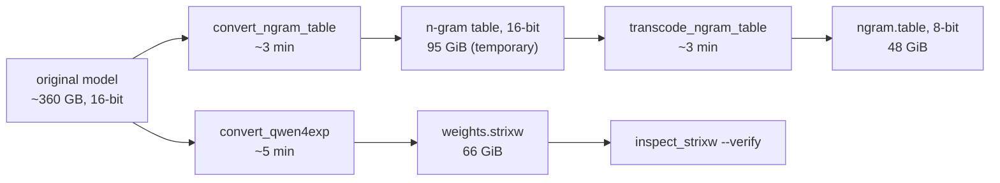

# The tools

Besides the server, strixite comes with four small command-line tools. You don't need any of them to run strixite -
the [Quick start](../README.md#quick-start) downloads ready-made weights. They're here for two reasons: to let you
**make the weights yourself** from the original model (no need to trust my files, or to wait for a 115 GiB download
if you already have the original), and to let you **check** a weights file.

| tool | in one line |
|---|---|
| `inspect_strixw` | look inside a weights file and check it isn't damaged |
| `convert_qwen4exp` | turn the original model into strixite's weights file |
| `convert_ngram_table` | pull the model's big n-gram table out into its own file |
| `transcode_ngram_table` | shrink that table to half the size |

All four are built along with the server (`cmake --build --preset strix`) and end up in `build/strix/`.

## Already have the original model? Make the weights yourself

If you've already downloaded [Qwen/Qwen3.8-Flash-Next](https://huggingface.co/Qwen/Qwen3.8-Flash-Next) - the
original ~360 GB checkpoint - you can build exactly the files strixite runs in about a quarter of an hour, instead of
downloading them again.

**What happens, in plain words:** the original model stores every number in 16 bits. strixite's weights store most
of them in 4 or 8 bits, already arranged the way its GPU code reads them. The tools read the original once, shrink
and rearrange it, and write the result where the server looks for it.



Times are from my machine (Strix Halo, fast NVMe); a slower drive takes longer, since most of the work is reading and
writing. You need room for the original, the results (~114 GiB) and, for a few minutes, the temporary 16-bit table
(95 GiB, deleted at the end).

The server looks for its files under `~/models/strix-infer`, so the steps below put everything there. Run them from
your strixite folder:

```sh
M=~/models/strix-infer
GIT=$(git rev-parse --short HEAD)    # recorded inside the files, so you can tell later what made them

# 0. The original model, if it isn't there yet (skip if you have it - or point --src at where yours is)
hf download Qwen/Qwen3.8-Flash-Next --local-dir $M/Qwen3.8-Flash-Next

# 1. The weights (the same layout I publish and serve)
build/strix/convert_qwen4exp --src $M/Qwen3.8-Flash-Next --out $M/converted/Qwen3.8-Flash-Next.U-gdn_in-g128 --git $GIT \
  --layout exp_gu=q4g128,exp_down=q4g128,sh_gu=q8g64,sh_down=q8g64,gdn_in=q4g128,gdn_out=q8g64,attn_qkv=q8g64,attn_o=q8g64,hc_down=q8g64,hc_up=q8g64,ple_kv=q8g64,lm_head=q8g64,mtp_fc=q4g64,embed=bf16

# 2. The n-gram table, first at full precision ...
build/strix/convert_ngram_table --src $M/Qwen3.8-Flash-Next --out $M/converted/Qwen3.8-Flash-Next.ngram --git $GIT

# 3. ... then shrunk to 8 bits, and the temporary full-precision copy removed
build/strix/transcode_ngram_table --in $M/converted/Qwen3.8-Flash-Next.ngram/ngram.table \
  --out $M/converted/Qwen3.8-Flash-Next.ngram-q8 --dtype q8 --git $GIT
rm -r $M/converted/Qwen3.8-Flash-Next.ngram

# 4. Check the weights file
build/strix/inspect_strixw $M/converted/Qwen3.8-Flash-Next.U-gdn_in-g128/weights.strixw --verify
```

The tokenizer and the two config files the server needs are already in your copy of the original model. If that
copy is in `~/models/strix-infer/Qwen3.8-Flash-Next`, the server finds them on its own; if it lives somewhere else,
set `tokenizer` and `generation-config` to its `tokenizer.json` and `generation_config.json` in
`deploy/strix-server.conf`. Then start the server as in the Quick start.

Each tool prints what it's doing as it goes and checks its own output before it finishes - the converter re-reads
the whole file it wrote, the table tools re-read a sample of rows and compare them with the original.

## inspect_strixw - look inside a weights file

**In plain words:** a weights file is one big file full of numbers. This tool shows you what's in it - which model,
how it was made, every piece inside - and, if you ask, checks every piece against the fingerprint stored with it, so
you know nothing got damaged in a download or on disk.

```sh
build/strix/inspect_strixw ~/models/strix-infer/converted/Qwen3.8-Flash-Next.U-gdn_in-g128/weights.strixw
build/strix/inspect_strixw ~/models/strix-infer/converted/Qwen3.8-Flash-Next.U-gdn_in-g128/weights.strixw --verify
```

The first prints the header - format version, model, the layout of every weight class, which converter made it and
when - and then one line per tensor. `--verify` re-reads the whole file and re-computes every piece's hash
(`--threads N` to use more cores; it reads at several GB/s on a fast drive).

## convert_qwen4exp - make the weights file

**In plain words:** this is the main converter. It reads the original model and writes one file, `weights.strixw`,
with every number already shrunk to the size strixite uses and arranged the way its GPU code reads it - so when the
server starts, it just loads the file into memory and goes.

```sh
build/strix/convert_qwen4exp --src ORIGINAL_MODEL_DIR --out OUTPUT_DIR --git HASH --layout LAYOUT
```

- `--src` - the folder of the original model (its `.safetensors` files and `config.json`).
- `--out` - where to write `weights.strixw` (and a `convert.log` of everything it did).
- `--git` - any short label; I use the strixite commit, so the file records what made it.
- `--layout` - how many bits each kind of weight gets. The layout in the steps above is the one I serve: 4 bits for
  the 512 experts (most of the model, but each word uses only a few), 8 bits for the parts every word reads. Leave it
  out and you get an older all-4-bit layout that is faster but noticeably less accurate.
- `--threads N` - how many cores to use. `--plan` prints what it would write, without writing anything.

## convert_ngram_table - pull out the n-gram table

**In plain words:** one layer of this model has a gigantic lookup table - 51 billion numbers - that is used a few rows
at a time. strixite keeps it as its own file on your SSD and reads only the rows it needs, rather than holding it in
memory. This tool copies the table out of the original model into that file, unchanged.

```sh
build/strix/convert_ngram_table --src ORIGINAL_MODEL_DIR --out OUTPUT_DIR --git HASH
```

It writes `OUTPUT_DIR/ngram.table` at full precision (95 GiB), then reads back a sample of rows and compares them with
the original.

## transcode_ngram_table - shrink the table

**In plain words:** the full-precision table is 95 GiB. Its numbers are all tiny, so storing each row in 8 bits with
one scale per row loses almost nothing - the rows come out within about 0.7% of the originals - and halves the size.
That smaller file is the one strixite uses.

```sh
build/strix/transcode_ngram_table --in FULL_TABLE --out OUTPUT_DIR --dtype q8 --git HASH
```

- `--dtype q8` - 8-bit rows with a scale per row (what strixite uses). `fp8` is also there - one scale for the whole
  table - but it's less accurate and I don't use it.
- It prints a line of statistics at the end: how far the shrunk rows are from the originals (median, 99th
  percentile, worst).

## Why the converters are included at all

Most people will just download the weights. I ship the converters anyway because:

- **You can check my work.** Anyone with the original model can rebuild the files and compare - nothing hidden
  between Qwen's release and what strixite runs.
- **You can try other layouts.** More bits for more accuracy, fewer for speed - `--layout` decides, per kind of weight.
- **It's the spirit of the license.** strixite is AGPL-3.0: you should be able to rebuild everything you run.
