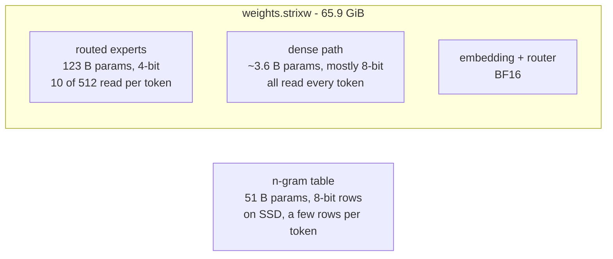

# What quant is this?

The short answer people usually want:

> **Mixed 4- and 8-bit, 4.41 bits per weight on average, 66 GiB** (plus an 8-bit n-gram table that stays on SSD).
> The routed experts - 96% of the file's parameters, but only 10 of 512 read per token - are 4-bit. Everything the model
> reads on every token is 8-bit. The token embedding and the router stay 16-bit. No calibration: plain
> round-to-nearest.

There's no single name for it, because different parts of the model get different formats on purpose. The rest of
this page is the long answer: what each part gets and why, what the formats are, and how much accuracy it costs.

## Where the bits go

The numbers below are read from the published `weights.strixw` itself (`inspect_strixw` prints every tensor).

| part of the model | parameters | share | format | bits per weight | size |
|---|---|---|---|---|---|
| routed experts, gate / up | 82.2 B | 64.0% | 4-bit, groups of 128 | 4.25 | 40.7 GiB |
| routed experts, down | 41.1 B | 32.0% | 4-bit, groups of 128 | 4.25 | 20.3 GiB |
| linear-attention (GDN) input projection | 1.52 B | 1.2% | 4-bit, groups of 128 | 4.25 | 0.75 GiB |
| linear-attention (GDN) output projection | 0.57 B | 0.4% | 8-bit, groups of 64 | 8.5 | 0.56 GiB |
| full attention q / k / v and output | 0.67 B | 0.5% | 8-bit, groups of 64 | 8.5 | 0.66 GiB |
| hyper-connection mixes | 0.66 B | 0.5% | 8-bit, groups of 64 | 8.5 | 0.65 GiB |
| shared expert | 0.24 B | 0.2% | 8-bit, groups of 64 | 8.5 | 0.24 GiB |
| LM head | 0.64 B | 0.5% | 8-bit, groups of 64 | 8.5 | 0.63 GiB |
| token embedding | 0.64 B | 0.5% | BF16 | 16 | 1.18 GiB |
| router | 0.06 B | 0.05% | BF16 | 16 | 0.12 GiB |
| MTP head's input projections | 0.01 B | - | 4-bit, groups of 64 | 4.5 | 0.01 GiB |
| norms, convolution, small vectors | - | - | FP32 | 32 | 0.02 GiB |
| **the weights file** | **128.4 B** | | | **4.41** | **65.9 GiB** |
| n-gram table (separate file, on SSD) | 51.2 B | | 8-bit rows, one BF16 scale per row of 160 | 8.1 | 48.3 GiB |

The vision tower isn't included - strixite is text only.

## Why it's split this way

Generating a token on this machine is limited by how many bytes of weights the GPU has to read, so bits cost speed
only where they're read often:

- **The routed experts** are almost the whole model, but each token uses only 10 of the 512 (plus the shared one).
  Extra bits there cost a lot of memory and little time - and they buy little: in my quantization study, putting
  the experts at 8 bits barely moved accuracy for 19-38 GiB more.
- **The dense path** - attention, the linear-attention projections, the hyper-connection mixes, the shared expert,
  the LM head - is a few GiB, and every token reads all of it. That's also where 4 bits hurt accuracy most: an
  all-4-bit layout agreed with the full model at only 194 of 242 positions, against 224 with every dense part at 8
  bits. So those get 8 bits.
- **The one exception, the linear-attention input projection,** stays at 4 bits: it's the biggest dense part (1.5 B
  parameters), and moving it to 8 bits gained only 2 positions out of 242 for about 4 ms more per token.
- **The token embedding** is a lookup - a few rows per token - so 16 bits costs memory, not speed. **The router**
  (which decides which experts run) is tiny, so it stays 16-bit.
- **The n-gram table** (51 B parameters, a hashed bigram / trigram embedding unique to this model) is also a lookup.
  It lives on SSD and is read a few rows at a time, so its bit depth costs disk, not memory or speed. At 8 bits its
  error is below the rest of the model's own noise; it's half the size of the 16-bit original.

## The formats, in plain words

- **4-bit, groups of 128 (`q4g128`)**: each weight is a whole number from 0 to 15. Every run of 128 weights along a
  row shares two 16-bit numbers, a scale and a minimum, and a weight is `code x scale + minimum`. The two shared
  numbers add 32 bits per 128 weights, so it's 4 + 0.25 = **4.25 bits per weight**. This is *asymmetric*
  quantization (the minimum lets a group's range sit anywhere, not centred on zero) - in my studies it was the most
  accurate per bit; a symmetric 4-bit format lost accuracy at every group size.
- **8-bit, groups of 64 (`q8g64`)**: the same scheme with codes 0 to 255 and groups of 64: 8 + 0.5 = **8.5 bits per
  weight**.
- **No calibration.** Each group's scale and minimum come from its own smallest and largest weight, and every
  weight is rounded to the nearest code - nothing is tuned on sample text. I tried calibrated 4-bit (fitting the
  rounding to activation statistics): it helped an all-4-bit layout, but stayed well below 8-bit dense parts, so the
  layout went the 8-bit route instead. Calibration may come back in a later layout.

At run time, the math is done in 32-bit floats and activations are stored in BF16; the KV cache is BF16.

## How much accuracy it costs

From my quantization study: the original model's own forward pass in full precision, with each weight class rounded
exactly as the converter does it, compared with the full-precision outputs on three prompts (short, long, chat):

| layout | agrees with full precision (top token, of 242 positions) | mean KL divergence |
|---|---|---|
| **this layout** | **226** | **0.028** |
| every dense part 8-bit (GDN input projection too) | 224 | 0.021 |
| all 4-bit (an earlier layout) | 194 | 0.124 |
| everything 8-bit (a ceiling - 124 GiB, doesn't fit) | 238 | - |

KL divergence measures how far the predicted next-token probabilities moved from the full-precision model's (0 =
identical). Top-1 agreement counts positions where both pick the same most-likely token. Differences of a few
positions are within the noise of three prompts.

Those numbers picked the candidates; the final choice was made by using them. I ran the candidates in real agentic
coding work, where a layout that's slightly slower but noticeably smarter wins.

## If you think in GGUF names

The closest comparison is a 4-bit build that keeps every dense projection at 8 bits - Unsloth's GGUF builds of this
model split it much the same way (experts at roughly 4.5 to 6 bits, every dense projection at 8). It isn't the same format, though: GGUF's
4-bit types use their own block layouts and, in Unsloth's case, an importance matrix, so file sizes and accuracy
don't translate one to one. If someone needs one line: *"4-bit experts, 8-bit everything else, ~4.4 bits per weight
on average, no imatrix."*

## Making a different mix

The layout is a converter option, one entry per part of the model - more bits for accuracy, fewer for speed. How to
build one, and the formats it accepts: [the tools](tools.md#convert_qwen4exp---make-the-weights-file).
