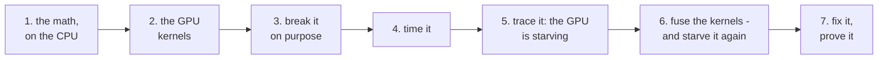
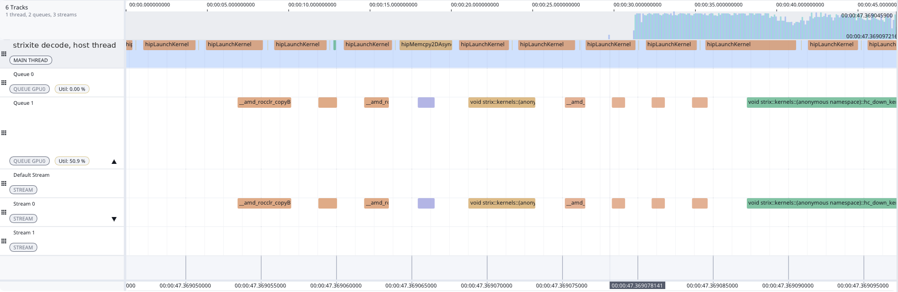
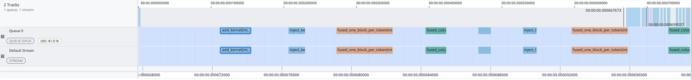
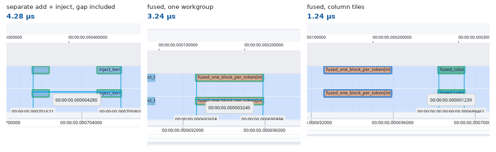

# Your first kernel

A GPU kernel is a small function that thousands of GPU threads run at the same time, each on its own piece of the
data. This lesson writes one - a real piece of the model strixite runs - the way every kernel in strixite was
written. Then it follows what actually happened to that piece in strixite: a trace showed the GPU starving between
tiny kernels, the fix for that passed every test and starved it a different way, and a second look at the trace
showed why.

You need a machine that builds strixite (see the [Quick start](../../README.md#quick-start)) - no model weights. It
takes an evening at most. One program, [`first_kernel.hip`](first_kernel.hip), holds every phase; read it alongside.



Build it:

```sh
cmake --build --preset strix --target first_kernel
build/strix/tutorial/first_kernel
```

## The piece this lesson writes

Every layer of the model ends by adding two results together and writing the sum back into the model's running
state. In plain words: two lists of 2,560 numbers get added, and the sum is mixed into four other lists of 2,560
numbers, each with its own weight.

```
y[c]    = moe[c] + shared[c]           for each of the 2,560 columns c
x[s][c] = x[s][c] + w[s] * y[c]        for each of the 4 streams s
```

That's it - additions and multiplications, about 10,000 of each per token. Small enough to see everything, real
enough to matter: the model does this 48 times for every token it writes.

## Phase 1: the math on the CPU first

> **What and why, in plain words:** before asking the GPU to do anything, work the answer out the slow, simple way -
> like checking a calculator against pencil and paper. The slow version is easy to read and easy to trust, so it
> becomes the answer key that every fast version gets graded against.

Before any GPU code, write the math as plainly as possible on the CPU - `reference()` in the program. It's slow and
it doesn't matter: its job is to be obviously right. Every GPU kernel will be checked against it.

(One detail: `x + w * y` is written as `fma(w, y, x)` - a "fused multiply-add", which rounds once instead of twice.
GPUs use it on their own, so the reference does too; otherwise the GPU and the CPU would differ in the last bit and
an exact comparison would be impossible.)

## Phase 2: the GPU kernels

> **What and why, in plain words:** a GPU is like a factory with thousands of workers who all do the same simple
> job at once. You don't tell one worker to do everything; you give each worker one number to handle. Workers are
> organized in teams (workgroups), and the factory has a fixed number of workstations (compute units) where teams
> do their work. This phase writes the job for the workers - then grades it against the answer key from phase 1.

The obvious GPU version is two kernels, one per line of the math, with **one thread per number**:

- `add_kernel` - thread `i` computes `y[i]`.
- `inject_kernel` - thread `i` updates one `x[s][c]`.

Threads are launched in **workgroups** of 256. For one token, `add_kernel` needs 2,560 threads = 10 workgroups, and
`inject_kernel` 10,240 threads = 40 workgroups. The GPU spreads workgroups over its compute units (Strix Halo has 40;
HIP reports them as 20 "work-group processors", two compute units each) and runs them at the same time.

Run the test:

```sh
build/strix/tutorial/first_kernel --test
```

It runs every kernel for 1, 7 and 512 tokens and compares the results with the CPU reference **bit for bit** - not
"close enough", identical. Every line should say `ok ... bit-identical`.

## Phase 3: break it on purpose

> **What and why, in plain words:** a smoke alarm that has never gone off might be working - or might have no
> battery. The only way to know is to set it off on purpose. Here you break the code deliberately and make sure the
> test complains. If it stays quiet, the test was never really checking anything.

A test that never fails proves nothing. So break the code and make sure the test notices:

```sh
build/strix/tutorial/first_kernel --mutate 1   # one workgroup too few: the last 256 columns never get updated
build/strix/tutorial/first_kernel --mutate 2   # every stream uses stream 0's weight
```

Both should end with `the test caught a difference`. If a mutation ever slips through, the test is too weak - fix the
test before trusting it. (In strixite every kernel's tests were checked this way, with several mutations each.)

## Phase 4: time it

> **What and why, in plain words:** "correct" isn't the whole goal - the point of a GPU is speed. So now, a
> stopwatch: how long does each version take, and how close does it come to the hardware's limit? Timing at two
> sizes matters, because the model works on one word at a time while answering, but on hundreds at once while reading
> your question.

```sh
build/strix/tutorial/first_kernel --bench
```

This times each version at **1 token** (what happens while the model writes, one token at a time) and **512 tokens**
(what happens while it reads a prompt). Each number is the median of 7 measurements of 200 launches.

Next to the time it prints **bytes moved** and **GB/s**. These small kernels are limited by memory, not arithmetic -
each number is used once or twice - so the useful question is: how close to the memory's speed do they get? (Strix
Halo's GPU reads at ~226 GB/s at best. At 512 tokens you may see numbers above that: the data is small enough to
stay in the GPU's caches between launches, which a benchmark loop flatters.)

## Phase 5: trace it - the GPU is starving

> **What and why, in plain words:** the stopwatch says how long something took, not why. A trace is like a security
> camera recording of the GPU: every job it ran, when it started and finished, and how many teams worked on it. This
> phase records the two kernels from phase 2 and looks at the recording. What it shows is a GPU that spends more time
> waiting for its next job than doing the jobs.

A profiler records every kernel the GPU ran - when it started, how long it took, how it was launched. ROCm's
`rocprofv3` captures that into a file:

```sh
~/tools/therock-tarball/install/bin/rocprofv3 --kernel-trace --output-format rocpd -d ~/traces/first-kernel -o run1 \
    -- build/strix/tutorial/first_kernel --trace
```

`--trace` runs each version five times at 1 token - a small, readable trace. It writes
`~/traces/first-kernel/run1_results.db`. Open it in AMD's **ROCm Optiq** trace viewer and zoom in on one round of
`add_kernel` followed by `inject_kernel` (skip the first round - see the pitfalls below). On my Strix Halo:

| | time |
|---|---|
| `add_kernel` runs | 0.72 µs |
| the GPU waits for the next launch | 1.9 µs |
| `inject_kernel` runs | 0.80 µs |
| the GPU waits again | 2.0 µs |

Here's what that looked like in strixite itself, before the fix - about 50 µs of the real engine generating text,
in ROCm Optiq:



What to look at:

- **The top row is the CPU** handing out work: one `hipLaunchKernel` after another, each taking a few microseconds.
- **The "Queue 1" row is the GPU** doing the work: short bars - many of them a microsecond or two - with empty space
  between them. Each kernel finishes and then waits for the next one to arrive.
- **"Util: 50.9 %" on that row:** over this stretch the GPU was busy only about half the time.
- **The "Stream 0" row shows the same bars again** - not a second copy of the work, but the same kernels seen from
  the other side. A *stream* is the program's ordered to-do list ("run this, then that"); a *queue* is the hardware
  inbox the GPU actually pulls work from, and the runtime delivers each stream's work into one. Read the queue rows to
  see whether the GPU was busy, the stream rows to see whether the program asked for things in the order it meant.
  (The empty "Queue 0" belongs to the default stream, which strixite doesn't use.)

Each kernel finishes almost as soon as the scheduler hands it its work, and then nothing happens for longer than the
kernel ran. The compute units are **starving**: there's plenty of hardware, but not enough work arriving to keep it
busy, and the cost of handing out each job - launching a kernel - is bigger than the job itself. `--bench` confirms it
without the profiler: one round of the pair takes 4.0 µs, while the kernels themselves run for about 1.5 µs.

### What I saw that the AI couldn't

I wrote strixite with an AI coding assistant, and this is a good example of how that actually works day to day. The
assistant can't *look* at a trace. It reads the file as a database - rows of kernel names and timestamps - and it's
great at what that's good for: sorting thousands of gaps, comparing two runs kernel by kernel, digging the one slow
kernel out of a million rows.

But some things jump out at a person in Optiq in about a second and just don't show up in a table. In strixite's
real traces it was obvious to me that the GPU was starving: kernels finishing so fast after the scheduler handed them
their work that the overhead of handing it out dwarfed the work. Far too much overhead. I pointed at it, the
assistant measured it - how much of each step was gaps, which kernel pairs were worst - and that's what led to fusing
these kernels.

That's the loop that worked for me: I look and point, the tooling measures and proves. Most of the little tools in
this lesson started that way - something I spotted on screen, turned into something that could be measured every
time.

**The same thing in the terminal** - [`trace_summary.py`](trace_summary.py) prints one line per kernel:

```sh
tutorial/first-kernel/trace_summary.py ~/traces/first-kernel/run1_results.db
```

### Before you trust a trace

> **In plain words:** watching something changes it a little. A profiler adds its own bookkeeping around every job
> the GPU runs, so a trace is a slightly distorted recording - great for seeing *what* happened and *in what order*,
> risky for exact *how long*. Use it to find the problem; use plain timing to measure it.

The pitfalls I ran into:

- **Different tools measure different things.** In the numbers above, the trace says `fused_column_tiles` took
  1.16 µs, while `--bench` said 2.20 µs. Both are right: the trace measures how long the kernel itself ran on the
  GPU, while `--bench` measures time per launch in a loop - including the gap between one kernel finishing and the
  next starting. Know which one you're quoting.
- **The tracer inflates small things.** Recording every kernel adds a little time around each one; the gaps *between*
  kernels looked about twice as long traced as they really were (~4% on a whole run). Compare traced to traced and
  untraced to untraced - never one against the other.
- **A gap in a trace may be the tracer itself.** In strixite a trace showed ~8.5 µs of gaps around one small kernel,
  which looked like a great reason to fuse it into its neighbours. Timed without the profiler, most of that gap
  wasn't there. Before you rewrite code to remove a gap, measure the gap without tracing.
- **Skip the first round.** The first launch of anything is slower (in this trace, `add_kernel` took 1.68 µs in round
  1 and 0.72 µs in round 2). That's why this lesson looks at round 2, and why `--bench` warms up first.
- **Anything else on the GPU shows up too.** Another program using the GPU - a running model server, a desktop
  compositor - slows kernels down at random moments. Look at several rounds, not one.
- **Keep traces short.** Every kernel becomes a row in the file; a trace of a whole model run is enormous and slow to
  open. Trace the smallest run that shows the problem - that's what `--trace` is for.
- **Use the profiler from the same ROCm as your build.** A mismatched `rocprofv3` (in my case, one from a Python
  package) traced fine but crashed or hung on the more advanced options.

## Phase 6: fuse the kernels - and starve it again

> **What and why, in plain words:** if handing out jobs costs more than doing them, hand out fewer, bigger jobs. The
> two-kernel version is like carrying boxes from the truck to a shelf, then from the shelf to where they belong.
> Fusing means carrying each box straight to where it belongs: one trip instead of two, and no stop at the shelf.
> This phase does exactly that - and finds a new way to leave the GPU idle.

Fusing the two kernels into one removes a launch (and its gap), and `y` no longer goes to memory and straight back:
compute it, use it immediately, never store it.

The first fused version, `fused_one_block_per_token`, is the natural way to write it: one workgroup per token, its
256 threads looping over that token's 2,560 columns.

Run `--test` again: **it passes.** Bit for bit, the same results as before. Now run `--bench` and look at the
1-token rows. The fused kernel - fewer launches, fewer bytes - is **slower** than the two separate kernels it
replaced.

This is the second trap, and the nastier one. Every test says the change is right, because it is - the numbers are
exactly the same. The problem isn't *what* it computes but *how the work is spread over the GPU*, and tests don't
look at that. Back to the trace - the same `run1` file has it:

```
kernel                             calls    avg us   total us workgroups
fused_one_block_per_token              5      3.31       16.6          1
fused_column_tiles                     5      1.16        5.8         10
add_kernel                             5      1.07        5.4         10
inject_kernel                          5      1.02        5.1         40
```

(From my Strix Halo. Your times will differ a little; the pattern won't.)

There it is, in the last column: the fused kernel ran as **1 workgroup**. One workgroup runs on one compute unit. For
one token, all 10,240 updates went to a single compute unit while the other 39 had nothing to do - 3.3 µs, longer than
the two separate kernels together, and almost three times the version in phase 7. The GPU is starving again, from the
other side: before, the jobs were too small; now there's one job, too big for one team.

The same file in ROCm Optiq, two rounds of the four versions (about 30 µs):



The long orange bars are `fused_one_block_per_token` - one team doing all the work. The short teal bars right after
them are `fused_column_tiles`, the fixed version from phase 7, doing exactly the same work in about a third of the
time. Click a bar in Optiq to see its launch shape: the slow one is 256 threads in a workgroup of 256 - a single
workgroup.

Optiq's **Measure** tool puts numbers on it (drag from the start of one bar to the end of another):



Look closely and it's more interesting than "the fusion was slower". In the trace, the one-workgroup fusion (3.24 µs)
*does* beat the separate pair with its idle gap (4.28 µs) - fusing really did remove the gap. It just spent almost
all of that saving doing the work on one team. And timed without the profiler, `--bench` puts it *behind* the pair
(4.6 against 4.0 µs a launch): the trace and the stopwatch measure different things, exactly as the pitfalls above
warn. The column-tiled version wins either way - 1.24 µs here, 2.2 µs in `--bench` - because it removes the gap
*and* keeps every team busy.

Why didn't the 512-token test show this? Because with 512 tokens the slow version launches 512 workgroups - plenty
to keep every compute unit busy. The problem only exists for small inputs, which is exactly when the model is
writing its answer. A benchmark at one size can hide what happens at another.

## Phase 7: fix it, and prove it

> **What and why, in plain words:** the fused version gave the whole job to a single team while every other team
> stood idle. The fix keeps the one-trip idea but splits the work back across many teams. Then prove three things:
> it still gives the same answers, it's actually faster, and it's faster for the reason you think.

`fused_column_tiles` splits the columns across workgroups as well as the tokens: a grid of (2,560 / 256 = 10 column
tiles) x (tokens). For one token that's 10 workgroups working at once - the same spread as `add_kernel`, without the
second launch, the gap after it, and the round trip through memory.

Prove all three things that matter:

1. **Still correct:** `--test` - bit-identical.
2. **Faster:** `--bench` - at 1 token, 2.2 µs against 4.0 µs for the separate pair and 4.6 µs for the starved fusion
   (my Strix Halo).
3. **For the reason you think:** trace it again (`-o run2`) and compare the two traces kernel by kernel:

```sh
tutorial/first-kernel/trace_summary.py ~/traces/first-kernel/run1_results.db ~/traces/first-kernel/run2_results.db
```

(To try that comparison yourself, change `fused_one_block_per_token`'s launch in `launch()` to the column-tile grid
between the two runs.)

## What happened in strixite

This is a real piece of strixite's history. The traces showed the GPU starving between small kernels like these,
so I fused them - and the fused kernel at the end of every MoE layer took the "one workgroup per token" shape from
one of the two kernels it replaced. Every test passed - the results were bit-identical. End to end,
generation got only 0.4% slower, small enough to look like noise. A per-kernel comparison of two traces found it in
minutes: in the trace, 15.7 µs for the fused kernel against 5.3 µs for the pair it replaced. With its columns split
across workgroups it ran in 2.7 µs (timed without the profiler, which adds a little to every kernel).

What I took from it, and still do every time:

- **Look at the trace, not just the totals.** Gaps longer than the kernels around them mean the GPU is waiting, not
  working - a person spots that in a timeline in seconds.

- **Tests prove a kernel is right, not that it's fast.** Check both, separately.
- **Time a fused kernel against the kernels it replaces**, at every size it runs at - one token as well as many.
- **When an end-to-end number moves a little, look at a per-kernel trace.** Small totals hide big individual changes.
- **Count the workgroups.** If a kernel runs as fewer workgroups than the GPU has compute units, most of the GPU is
  idle.

## Where to go next

- Change `kThreads` (the workgroup size) to 64 or 1024 and see what happens to the times and the workgroup counts.
- Try `--bench` at other token counts: edit the `{1, 512}` list in `bench()`.
- Read a real kernel: `moe_shared_add_inject` in `kernels/moe_router.hip` is strixite's version of this exact
  operation - the fixed one.
